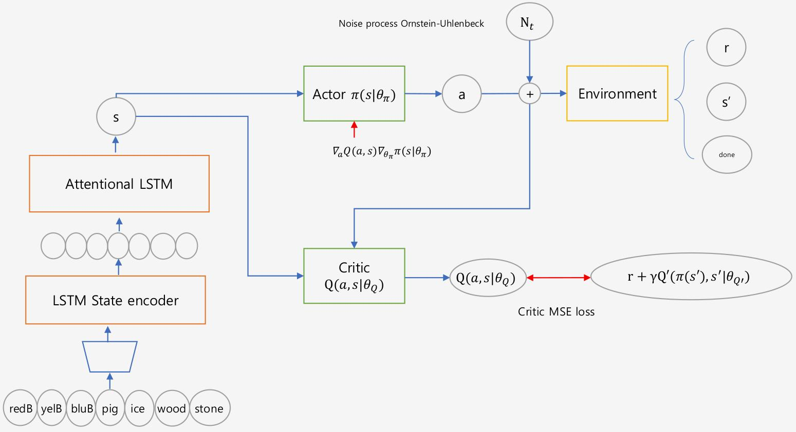
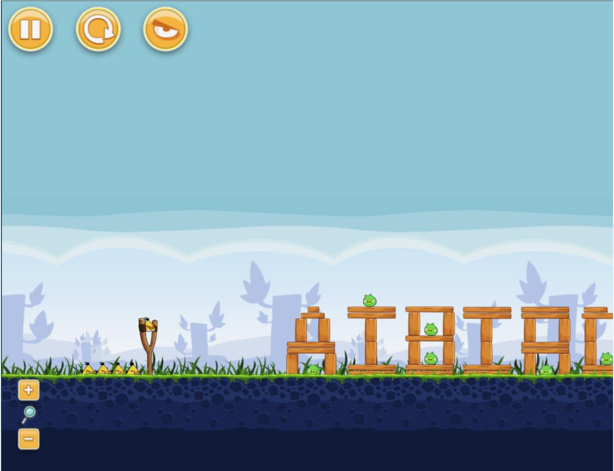
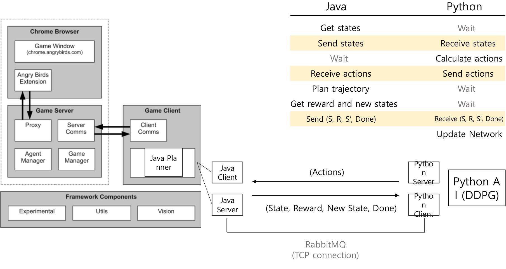

# AngryBirds_RL

Tensorflow implementation of a sequential decision-making agent for solving ‘Angry Birds’ using Deep Deterministic Policy Gradient (DDPG) with Attention-based Long Short-Term Memory (LSTM) for state encoding. In other words, we explore a model with a deterministic policy using an actor-critic algorithm for learning off policy with a stochastic behavior policy.

Within [Angry Birds Basic Game Playing Software](https://aibirds.org/) environment.

 
<i>Structure overview of the Angry Bird player: DDPG with Attention-based LSTM State Encoder.</i> 

## Preliminary

The code collects transitions which consist of (state, action, reward, new state, done) tuples. A raw state is a list of categories for 7 different objects: red bird, yellow bird, blue bird, pig, ice, wood, stone, and each category consists of n elements of objects with coordinates: x, y, width, height, angle. This state goes to the input of attentional LSTM state encoder and then, the output is the vector, size of [batch x n_hidden]. The action includes a measure of how much a band of the sling can extend for two different directions: x and y, and tap time for yellow bird and blue bird considering their characteristics, e.g. action scales [[0, -35], [0, 35], [0,2000]]. The reward is the score that we get from the game agent after performing each action. Lastly, states and rewards are normalized to [0, 1].

## Model Description

‘Angry Birds’ is a game with a continuous action and state space. The policy gradient methods proved their effectiveness in a number of various domains. However, for a stochastic policy, the variance of a gradient estimate goes to infinity as policy becomes more and more deterministic.
Therefore deterministic policy, a limiting case of a stochastic policy (proved by D.Silver 2014) where we simply update policy parameters in the direction of gradients of a Q function, was proposed to deal with high-dimensional continuous action spaces.

In order to explore with a deterministic policy, we use an actor-critic algorithm for learning off policy with a stochastic behavior policy. In our case exploration policy is obtained by adding a noise from an Ornstein-Uhlenbeck process (Uhlenbeck & Ornstein, 1930) to a deterministic action from an actor.

Since the java visual module is able to extract locations of movable objects (each location is of size n_coord = 5), we decided to use this information for a state description over the raw image as it contains already all useful information without the noise or background. 

 
<i>GIU of the Angry Birds.</i> 

In this game, we considered 7 main categories of objects: red bird, yellow bird, blue bird, pig, ice, wood, and stone. On each screen there can be a different number of these objects, thus to encode the sequences of different length we selected LSTM.
Also in actor-critic architecture, there are two streams of gradients coming from two networks (actor and critic), it was one of the main reasons to use LSTM encoding since in this case the encoded state is fed to actor and critic and thus LSTM could be trained faster due to double error backpropagation.

The input is a list with 7 elements of size [batch x seqlen x n_coord], where seqlen (sequence length) varies for each category. Firstly, each category of object of size [batch x seqlen x n_coord] is transformed linearly with a unique matrix into [batch x seqlen x n_hidden], which is later encoded into a fixed size vector [batch x n_hidden] with a multiple layer LSTM. After that, we have 7 vectors of size [batch x n_hidden] that is encoded with attentional LSTM into a one fixed size vector [batch x n_hidden], which in principle has to catch the importance of each category and to which one pay more attention. 

## Connection Pipeline 

 
<i>Connection pipeline overview.</i> 

## Credits
Reimplementation of DDPG based on OpenAI Gym + Tensorflow: [@floodsung](https://github.com/floodsung/DDPG)

Developers of Angry Birds Basic Game Playing Software [https://aibirds.org/](https://aibirds.org/)
